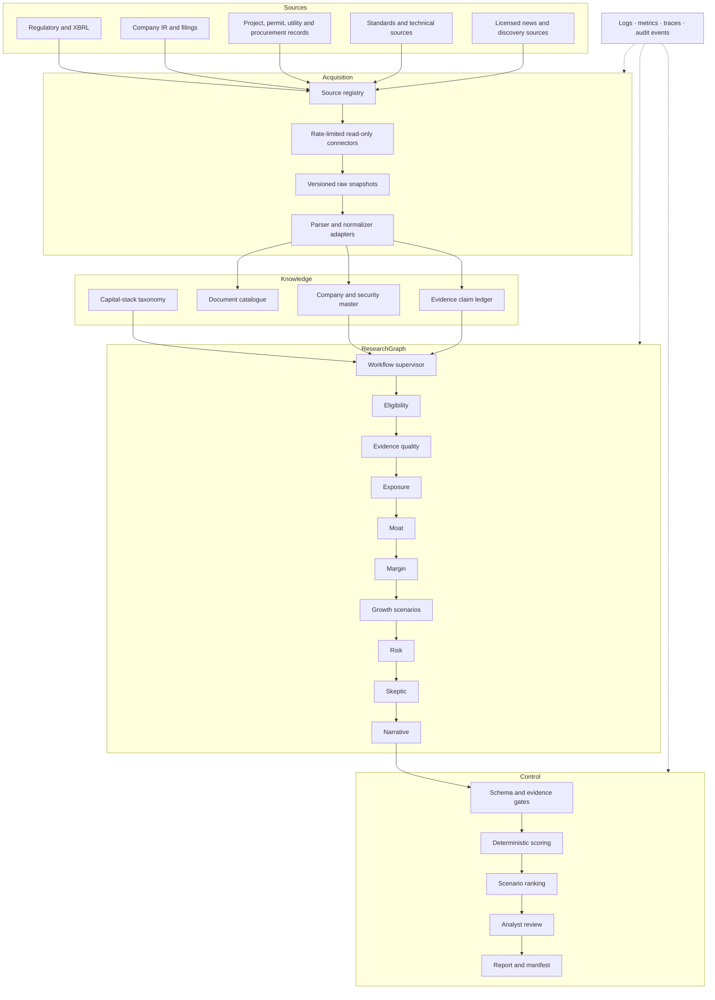

# System architecture

## System objective

For a frozen research cutoff, the platform converts public and appropriately licensed evidence into a ranked set of public companies whose **fundamental growth** is exposed to AI-factory capital expenditure.

The output is deliberately narrower than equity-return prediction. Without valuation, price, discount-rate, and balance-sheet timing analysis, the platform cannot claim that the highest-ranked company will produce the highest shareholder return.

## Architectural principles

1. **Point-in-time by construction.** Every run contains an `as_of_date`; evidence published later is ineligible.
2. **Evidence before judgment.** Agents receive normalized claims and evidence IDs, not unrestricted browsing context.
3. **Workflow before autonomy.** A typed state graph controls the order, tool set, retry boundary, and stopping condition.
4. **Code owns numbers.** Margins, scenario conversion, risk discount, score, ranks, and release gates are deterministic.
5. **Confidence is separate from quality.** Evidence confidence never masquerades as moat or growth.
6. **Retrieved text is untrusted.** Instructions embedded in documents are flagged and never executed.
7. **Every output is reproducible.** A report manifest records data, prompt, taxonomy, model, and scoring versions.
8. **Humans authorize publication.** An agent may propose a dossier; only an analyst can approve it.

## Component view



## Runtime topology

### Reference deployment

- One API/worker process.
- SQLite in WAL mode.
- Local report and raw-source directories.
- LangGraph if installed; equivalent local graph otherwise.
- Thread-pool fan-out across companies; sequential typed steps inside a company dossier.

This is suitable for an assignment, developer workstation, or controlled pilot.

### Production deployment

- API replicas separate from worker replicas.
- PostgreSQL for security master, evidence, run state, review, and rank data.
- S3-compatible versioned object storage for raw sources.
- Queue or Temporal for durable outer workflows.
- LangGraph for the bounded company-research graph.
- OpenTelemetry collector, logs, metrics, and an LLM evaluation/tracing backend.
- SSO, RBAC, secret manager, network egress policy, and private model gateway.

Do not place n8n inside the scoring or research-decision path. If used, it should trigger refreshes or deliver notifications. The versioned research graph and deterministic score remain in code.

## Workflow state

Each company graph receives:

```text
run_id
as_of_date
company/security identity
eligible evidence claims
scoring policy snapshot
company assessment under construction
```

The state never contains credentials. A graph node receives only the tools and evidence required for its role.

## Parallelism

Companies are independent until portfolio-level ranking, so the supervisor fans out one workflow per company and later performs a deterministic fan-in. Within a company, the reference implementation is sequential for clarity. In a distributed deployment, moat, margin, and growth may run concurrently after the evidence bundle is frozen; risk and skeptic nodes must wait for their outputs.

## Failure semantics

- Source retrieval: exponential retry, rate limiting, content hash, dead-letter after exhaustion.
- Parser: preserve raw source, record parser failure, allow an alternate parser.
- Company agent: isolate failure to that company and persist a non-rankable assessment.
- Scoring: fail closed on non-finite, missing, or out-of-range values.
- Publication: fail closed until all ranked companies are approved.
- Rerun: create a new immutable run; never mutate historical rank output.

## Trust boundaries

1. Internet content is untrusted.
2. Parser output is untrusted until schema and unit validation.
3. LLM output is untrusted until schema, citation, range, and deterministic checks.
4. Analyst overrides are privileged and audit logged.
5. Published reports contain approved claims only.

